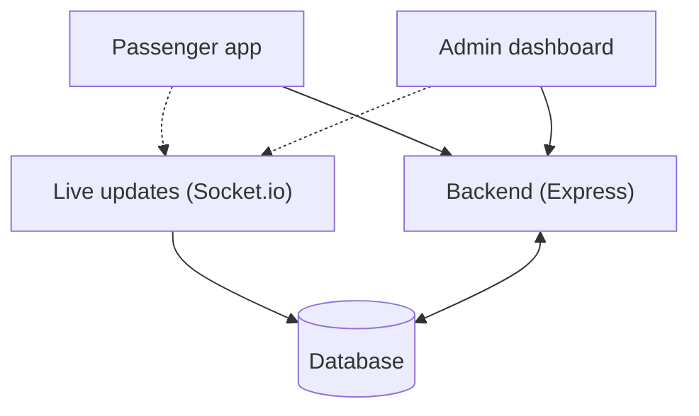
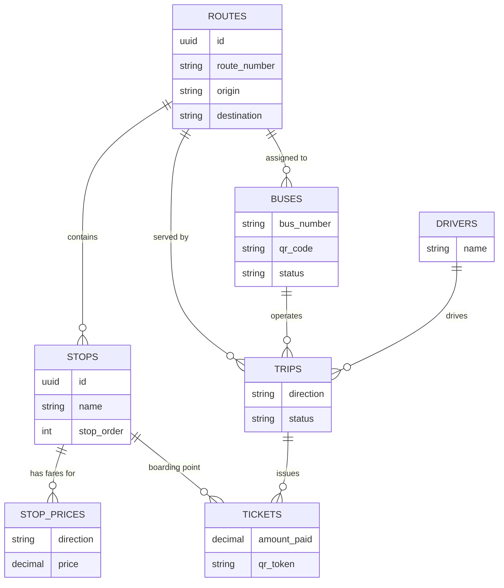

# City Bus Transit System

## What this project is about

When someone moves to a new city, three things make using the bus harder than it should be:

1. They don't know which bus goes where they're going.
2. They don't know when the next bus will actually show up.
3. They can't pay digitally — it's cash only.

This project fixes all three. A passenger can search where they're starting from and where they're going, see the right bus moving toward them on a live map, and pay by scanning a QR code on the bus. On the admin side, the city gets a dashboard showing which routes make money, which buses are running, and where everything is in real time — something that doesn't exist today with cash-only buses.

---

## What's actually built

There are two apps, both fully working and connected to a real database — not mock data.

**Passenger app** — search for a trip, see the bus live on a map, scan a QR code to pay, get a digital ticket.

**Admin dashboard** — log in, manage routes and stops, set fares, register buses and drivers, start and end trips, and see revenue per route.

Two more pieces — a driver app and a ticket-inspector app — were planned but intentionally left out of this version. They weren't needed to prove the system works, and leaving them out kept the project realistic for the timeline. Both are easy to add later without changing anything already built.

---

## How it's built

| Part | What I used |
|---|---|
| Backend | Node.js + Express |
| Database | PostgreSQL |
| Live updates | Socket.io (so the bus moves on the map without refreshing) |
| Passenger app | React + Tailwind |
| Admin dashboard | React + Tailwind |
| Map | Leaflet (free, no API key needed) |
| QR scanning | The phone/laptop camera, via a library called html5-qrcode |
| Login | JWT tokens |

One honest simplification: there's no real GPS hardware on a bus right now, so a small script moves the bus's coordinates automatically to simulate it. The important part is that this script talks to the backend exactly the same way real GPS hardware would — so swapping in real GPS later means zero backend changes.

---

## How the pieces connect



Both apps only ever talk to the backend — never directly to the database. The backend is where all the real logic lives: calculating fares, checking permissions, finding routes.

---

## The databas



A few decisions worth explaining:

- **Drivers aren't permanently tied to one bus.** Drivers work shifts and sometimes swap, so the link between a driver, a bus, and a route only exists for the length of one trip — not as a fixed rule.
- **Fares change based on direction.** Going one way costs differently than going back, and the fare drops the closer the bus gets to the end of the route. Each stop has two separate prices stored for this reason.
- **A ticket is locked in once it's created.** If fares change later, old tickets keep their original price — so revenue reports stay accurate to what actually happened.

---

## The API, briefly

Everything below is a real, working endpoint.  means it requires an admin login.

**Routes** — search by origin/destination, look up by route number, create/edit/delete 

**Stops** — list stops for a route, add a stop  delete a stop 

**Fares** — get fares for a stop, set many fares at once 

**Buses** — list buses, look up by QR code, register a bus , assign to a route , update GPS location

**Drivers** — list drivers, register , remove 

**Trips** — see active trips, start a trip , end a trip 

**Tickets** — scan and pay (public — passengers aren't logged in), see revenue by route

---

## What works right now

**Passenger app**
- Type where you're starting and where you're going — it finds the right bus route, even if both points are in the middle of the route, not just the start/end
- See the bus moving live on a map
- Scan a real QR code with your camera to pay
- Get a digital ticket showing the price, time, and route

**Admin dashboard**
- Secure login
- See active trips, tickets sold, and revenue per route at a glance
- Add routes, add stops, set fares for all stops on a route in one save
- Register buses and assign them to routes
- Register drivers, start trips, end trips

---

## Security — what's solid and what's not

I checked this project against the OWASP Top 10, the standard list of common web security risks.

**Solid:**
- Every database query is built safely — no way to inject malicious SQL
- Every action that changes data (creating a route, starting a trip, etc.) requires admin login

**Known gaps, left in on purpose for this version:**
- Only one admin account exists, hardcoded for the demo — no real user management
- No limit on login attempts, so password guessing isn't blocked
- The API currently accepts requests from any website (this needs to be locked down before a real launch)
- No security logging — if something suspicious happened, there's no record of it yet

None of these affect the demo or the core idea — they're the kind of things you fix before going live, not before showing the concept works.

---

## What's intentionally left for later

- **Real mobile money payment.** Right now, scanning a QR code creates a ticket record — it doesn't actually move money. Hooking up something like Telebirr requires getting approved as a business first, which is outside what's possible in this timeframe. The system is built so this slots in later without reworking anything.
- **Driver and validator apps.** Not built, but the database already has what they'd need (like a field for "was this ticket checked").
- **Driver shift scheduling.** Not tracked yet — only who drove which trip, not their working hours.

---

## How to run it

You need Node.js and PostgreSQL installed.

**Backend**
```bash
cd bus-system-server
npm install
npm run dev
```
(Set up a `.env` file first with your database connection, a JWT secret, and an admin username/password.)

**Passenger app**
```bash
cd passenger-app
npm install
npm run dev
```

**Admin dashboard**
```bash
cd admin-dashboard
npm install
npm run dev
```

Both apps expect the backend running at `http://localhost:5000`.
